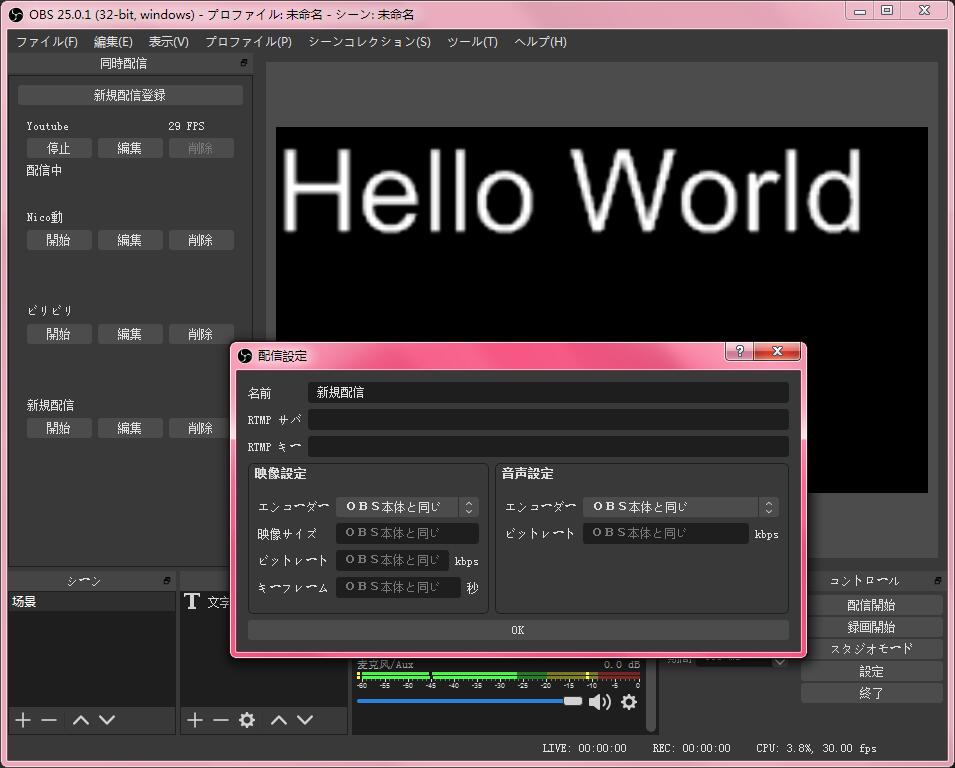

# LAIVE OBS RTPM — Documentação

Página de documentação oficial do plugin **LAIVE OBS RTPM**.

## Screenshot



## Download

[Página de Releases](https://github.com/thayronsabino/laive-obs-rtpm/releases/)

## Guias

- [📸 Instagram Live — Guia Avançado](./guia-instagram-live.md)

## Instalação

### Windows

#### Instalador
Execute o instalador `.exe` e siga os passos. Não altere o diretório de instalação padrão.

#### Versão Portátil
Extraia o arquivo `.zip` em `C:\Program Files\obs-studio`.

#### Desinstalação
Use o instalador para desinstalar. Se necessário, remova manualmente a pasta `C:\ProgramData\obs-studio\plugins\obs-multi-rtmp`.

### macOS
Execute o instalador `.pkg`. Ele instala automaticamente no diretório correto do OBS Studio.

### Linux (Ubuntu/Debian)
```bash
sudo dpkg -i laive-obs-rtpm-*.deb
```

## FAQ

**P: O painel do plugin não aparece no OBS.**

R: Tente mudar para o modo Estúdio. Se ainda não aparecer:

1. Vá em `Ajuda → Arquivos de Log → Exibir Arquivos de Log`.
2. Feche o OBS.
3. Abra a pasta `AppData\Roaming\obs-studio` (digite `%appdata%` no Executar).
4. Abra `global.ini` em um editor de texto.
5. Encontre a linha `DockState=XXXXXXXX` (texto longo).
6. Delete essa linha e salve.
7. Reabra o OBS.

## Build

Consulte os scripts de integração contínua em `.github/workflows/` para instruções de compilação.
